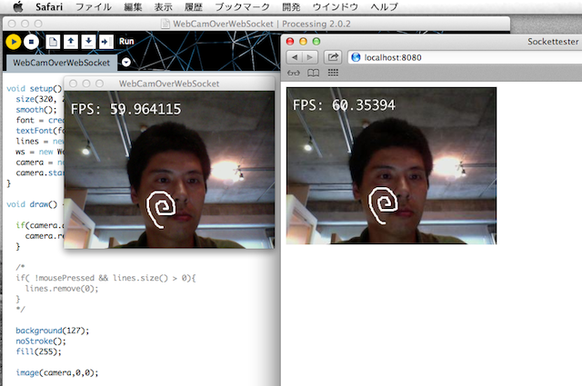

WebSocketを使ったWebカメラ サンプル:
====

Processingで動作するサンプルアプリです。ブラウザでWebカメラの画像を共有して見ることができます。

Webカメラからキャプチャーした画像をJPG画像にしてWebSocketで配信します。
WebSocketP5ライブラリを使用しています。

http://p5.twelvebytes.net/websocketP5-0.1.2/

***

使い方:
----------------------

1. WebSocketP5ライブラリをProcessingフォルダのlibrariesにインストールします。
2. スケッチ "WebCamOverWebSocket.pde" を読み込んで実行します。
3. ブラウザで "http://localhost:8080"  にアクセスします。
4. Processing側の画面でマウスをドラッグすることで白いラインを描画できます。
